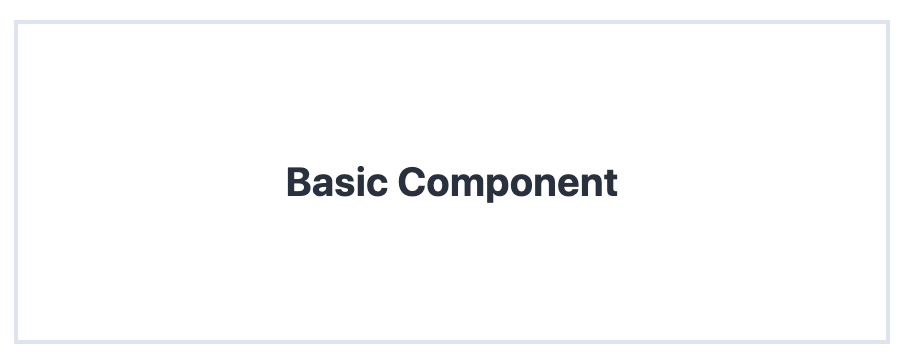
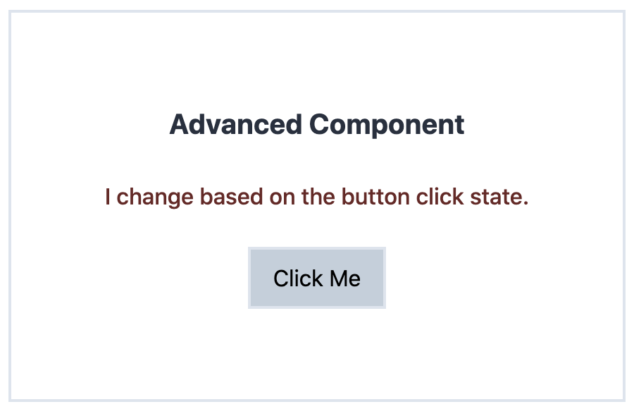

You can find all source code for this post in a starter template [here](https://github.com/RyanFitzgerald/react-tailwind-starter).

## What is Tailwind?

You've probably heard of Tailwind by now, but if you haven't, it is essentially a utility-first CSS framework and is much less opinionated compared to other CSS frameworks like Bootstrap and Foundation. According to [tailwindcss.com](https://tailwindcss.com), it is described as:

> A highly customizable, low-level CSS framework that gives you all of the building blocks you need to build bespoke designs without any annoying opinionated styles you have to fight to override.

In my opinion, this makes Tailwind a great option to use for your projects. You get the benefits of rapid development, without the opinionated styles that you ultimately override anyway.

So what if we want to use Tailwind with React, is it as simple as just including a style sheet? Not exactly. Because of how Tailwind is built and some of the optimizations they have in place (i.e. purging unused CSS), there are a couple extra steps to properly set it up in a React project.

## Getting the Project Setup

To get started, either jump into your own React project or start up a new one with `npx create-react-app tailwind-react-app`.

### Installing Dependencies

Next, let's install a couple of dependencies via `npm i @fullhuman/postcss-purgecss postcss-cli tailwindcss --save-dev`.

A brief explanation of each dependency:

- `fullhuman/postcss-purgecss` - used to purge unused CSS to create the smallest final CSS file possible. If you don't purge unused CSS, tailwind is actually over 2MB uncompressed.
- `postcss-cli` - Tailwind is a PostCSS plugin. You don't need to use PostCSS as the preprocessor, but in this case we will in order to keep things simple.
- `tailwindcss` - the Tailwind library and utilities

### Create Config Files

Now that we have our dependencies installed, we need to create a couple config files.

First, create your Tailwind config by running `npx tailwind init` in the project root. You can choose to update some of the Tailwind config here if you wish.

Next, create your PostCSS config by creating a `postcss.config.js` file in the project root and adding the following content:

```js
const purgecss = require('@fullhuman/postcss-purgecss')({
  content: ['./src/**/*.js', './src/**/*.jsx', './public/**/*.html'],
  defaultExtractor: (content) => content.match(/[A-Za-z0-9-_:/]+/g) || [],
});

module.exports = {
  plugins: [
    require('tailwindcss'),
    ...(process.env.NODE_ENV === 'production' ? [purgecss] : []),
  ],
};
```

In the first portion, we require and setup `purgecss`. This requires two pieces. The first is the list of purgeable files which are js, jsx, and html (you can also add `.ts` and `.tsx`). The HTML is required so the base styles (e.g. `body`, `html`, etc) don't get purged.

The second portion is used to define the extractor function (i.e. rules for which content to keep). PurgeCSS is naive by nature, meaning it will look for content that matches that Regex in the file types listed above. This is important to know and will be revisited when we discuss patterns below.

### Importing Tailwind CSS

Now that we have our dependencies installed and our config files setup, we can actually add the Tailwind CSS file to our app. To begin, create a `tailwind.css` file in the `src/` folder with the following Tailwind directives:

```css
@tailwind base;
@tailwind components;
@tailwind utilities;
```

This will pull in and compile the styles for us automatically when we build our Tailwind output. It's also useful to note that this file is where we could add our own Tailwind custom utilities if we wanted. For more information on adding new utilities, [click here](https://tailwindcss.com/docs/adding-new-utilities#using-css).

Finally, let's import the output file (which we will create via the build scripts in the next section) to our `app.js` so it is available globally throughout our app.

```jsx
import './tailwind.output.css';
```

You may need to change the path if your `app.js` isn't directly in the root of the `/src` folder, as that is where this will output by default.

### Setting Up Build Scripts

The last step to get Tailwind working is to create a couple quick build scripts to ensure that the output file gets built. Let's add the following to our scripts section in `package.json`:

```json
"tailwind:build": "NODE_ENV=production postcss src/tailwind.css -o src/tailwind.output.css",
"tailwind:dev": "postcss src/tailwind.css -o src/tailwind.output.css",
"prestart": "npm run tailwind:dev",
"prebuild": "npm run tailwind:build",
```

There are two separate Tailwind scripts we created. The first `:build` one is for production builds (i.e. run the `PurgeCSS` we defined above), whereas the second one is a dev build which keeps the full Tailwind CSS since we want to access all the styles as we're developing.

The next part is the `prestart` where we run the dev build prior to staring up the React development server. You could take it a step further and add a watch script that checks for changes to `tailwind.css`, but I've found that additions / changes to this file are pretty rare, so I simply restart the dev server if this comes up.

Finally, the last part is the `prebuild` script which runs the production (purged) Tailwind build which will result in a CSS file that only contains styles we've actually used in our app.

That's it! You should now be up and running with Tailwind in your React app. If you're looking to take it a step further, in the next section I'll go over some design patterns and common gotchas when dealing with Tailwind in React.

## Design Patterns

Now that we have Tailwind running within our app, when we can discuss some design patterns that make it easy to work with in React components.

### What Not To Do

Before jumping into some patterns, I think it's worth mentioning what not to do. How you decide to use Tailwind in your app is ultimately up to your preference, but there is one common mistake that can quickly get you into some trouble and it relates to the purging of the unused CSS as I mentioned above.

Let's look at an example to illustrate the issue. Assume we have a basic input component as follows:

```jsx
<input className="border-2 border-gray-300 p-2" type="text" />
```

Now, let's say we want to conditionally change the border to red if there is an error somewhere. If we have an `error` state / prop variable, we may be tempted to do something like:

```jsx
<input
  className={`border-2 border-${error ? 'red-500' : 'gray-300'} p-2`}
  type="text"
/>
```

At first glance, this looks correct. In fact, it would render the correct classes and work just fine in development. However, once you build the production version of your app, you would notice these styles are missing, but why is that? As mentioned earlier, PurgeCSS runs against our production build to create the smallest Tailwind CSS file possible. It simply looks at the file types your provided and tries to find content matching the Regex. In this case, when it checks this component file, it won't match on `border-red-500` or `border-gray-300` because they are built dynamically.

So how do we avoid this? The easiest way is to always ensure when writing Tailwind classes in your code, the full class name is there and isn't built dynamically. Therefore, using the above example, we get:

```jsx
<input
  className={`border-2 ${error ? 'border-red-500' : 'border-gray-300'} p-2`}
  type="text"
/>
```

Now when PurgeCSS runs against this file, it will keep `border-red-500` and `border-gray-300`, as it should.

Let's take a look at some basic Tailwind patterns we can use in our app now that we know what not to do.

### Basic Pattern

A pattern I've been using for a little while now is one that involves defining all of your classes above the component in an object with strings for each element.

For example, here is a basic component:



Using the above pattern, the component code would look like:

```jsx
const classes = {
  wrapper: 'border-2 m-16 p-16',
  title: 'text-gray-800 text-xl text-center font-bold',
};

const BasicComponent = () => {
  return (
    <div className={classes.wrapper}>
      <h1 className={classes.title}>Basic Component</h1>
    </div>
  );
};
```

This basic pattern has a couple nice benefits:

1. It keeps the component definition clean, especially if there are a number of elements or if class names get long
2. It makes it easy to reuse classes in multiple places. Also, if you need to change styles, you only do it in one place in the component.
3. All classes are fully defined in the file, so there are no issues with PurgeCSS
4. You get a nice overview of all styles for your component in one neat place

With that said, what do we do when we get more advanced components that need to change as state or props change in our app? Let's take a look at a more advanced pattern that expands on this.

### Advanced Pattern

Now that we have a basic pattern involving the definition of all our classes above our component, we can take it a step further when we start to have more dynamic components.

For example, here is a more dynamic component:



In the above screenshot, both the button and the subtitle text change when the button is clicked on. Let's look at the code for this component:

```jsx
const classes = {
  wrapper: 'border-2 m-16 p-16 text-center',
  title: 'text-gray-800 text-xl font-bold',
  description: (active) =>
    `my-6 ${active ? 'text-red-900 font-medium' : 'text-gray-800'}`,
  button: 'py-2 px-4 bg-gray-100 border-2 focus:outline-none',
  buttonActive: 'bg-gray-400',
};

const AdvancedComponent = () => {
  const [active, setActive] = useState(false);

  return (
    <div className={classes.wrapper}>
      <h1 className={classes.title}>Advanced Component</h1>
      <p className={classes.description(active)}>
        I change based on the button click state.
      </p>
      <button
        className={clsx([classes.button, active && classes.buttonActive])}
        onClick={() => setActive((prevState) => !prevState)}
      >
        Click Me
      </button>
    </div>
  );
};
```

The first thing to notice is the `description` class. Unlike the others, this one is a function that takes in a parameter (or multiple) and outputs a slightly different class (text color and font weight in this case) string as a result. This allows you to maintain the benefits of the basic design pattern, but also add in a conditional aspect as well. It's also import to note, the classes are still fully defined as well so PurgeCSS will still have no issues.

Another method of creating dynamic classes while maintaining the basic pattern is what was done with the `button` and `buttonActive` classes. In this case, the `clsx` module was used to dynamically add classes based on conditions. The `classes.button` class was added without conditions (the base styles), however `classes.buttonActive` is only added if `active` is true. This method also works well when you have a number of conditionally added classes to an element or if your classes are just getting a little out-of-hand and you want to break them down a bit. Once again, PurgeCSS will work fine with this method as the underlying classes are fully defined.

## Conclusion

I hope this helped get you up and running with Tailwind on your React app and gives you some inspiration on how you can use it within your components in a way that makes it easier to work with.

If you have any questions, suggestions, or run into any issues, feel free to [reach out on Twitter](https://twitter.com/rfitzio).
